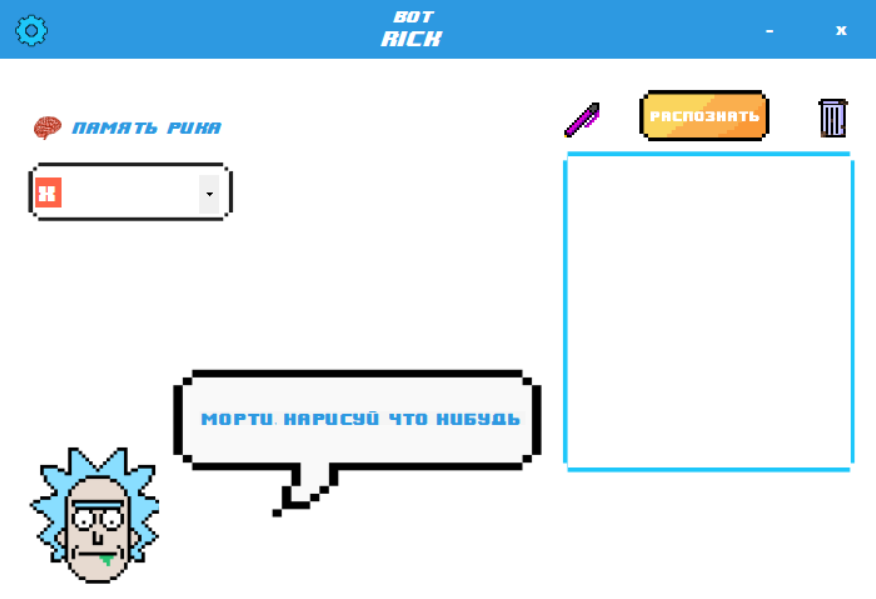
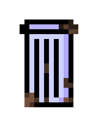
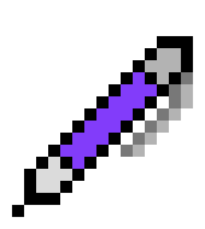
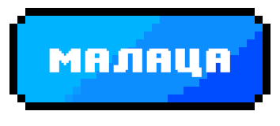

# RickBot

<h2 align = "center">
My first NN
</h2>
<h3>~Preview
  

<h3>~Setting  </h3>

<ul>
 - this button allows training (adding an image) of the neural network
for positive responses
</ul>

<ul>
 - this button open burger-menu
</ul>

<ul>
 - this button clear canvas
</ul>

<ul>
 - memory load button(symbols .txt)
</ul>

<ul>
 - draw the loaded symbol on the canvas
</ul>

<ul>
 - the neural network didn't guess
</ul>

<ul>
 - praise the neural network
</ul>

<ul>
 - to recognize the image
</ul>
